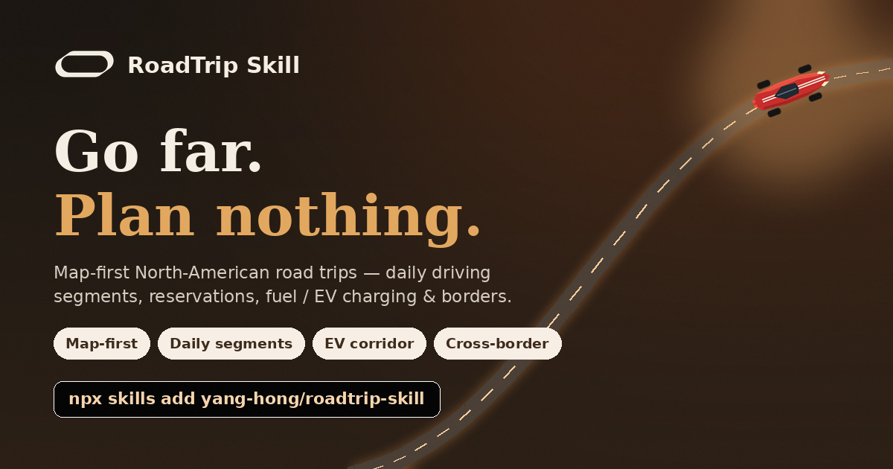

<div align="center">


# 🚗 RoadTrip Navigator

### An AI agent skill that turns *"start + days"* into a road trip you can actually drive.

**English** · [简体中文](README.zh.md)

[](#-install)
[](#-install)
[](#optional-api-keys)
[](LICENSE)
[](#-contributing)

<br/>



</div>

---

North American road trips revolve around the **car**, not flights: *how many hours
do we drive today, where do we sleep, will we make it on the fuel/charge we have,
and is the road even open.* RoadTrip Navigator plans around exactly those
questions and renders a **map-first, offline-friendly single-file HTML** itinerary
you can open on your phone.

> ⚡ **Install in Claude Code:** `/plugin marketplace add Waybox-AI/roadtrip-skill` → `/plugin install roadtrip-navigator@roadtrip-skill`

## ⚡ Install

Install it into **Claude Code** as a plugin — two commands, no API key:

```text
/plugin marketplace add Waybox-AI/roadtrip-skill
/plugin install roadtrip-navigator@roadtrip-skill
```

<details>
<summary>Other ways to install</summary>

```bash
# Manual — drop it in the skills folder
git clone https://github.com/Waybox-AI/roadtrip-skill
cp -r roadtrip-skill ~/.claude/skills/roadtrip-navigator   # user-level
# or  .claude/skills/  for a single project
```

The agent auto-loads the skill when your request matches road-trip triggers
(*road trip, self-drive, 自驾, national park, EV road trip, RV trip, scenic
drive, …*). No keys needed to run.
</details>

Then just ask your agent:

> *"Plan a 7-day Southwest national parks road trip from Las Vegas for 2 adults in September, gas SUV, loop."*

## ✨ Why it's different

Most "AI trip planners" hand you a list of attractions. This one does the five
hard things pure-model answers usually get wrong:

| | Generic AI itinerary | **RoadTrip Navigator** |
|---|---|---|
| **Daily driving** | a wishlist of stops | route **sliced into days** under a sane drive limit, with overnight towns, *"arrive before dark"* + *"no closed gate"* checks |
| **Reservations** | "book early!" | a **countdown to-do list** — exact *"book by"* dates (campgrounds ~6mo, in-park lodges ~13mo, timed-entry permits) on the **right system** (Recreation.gov / ReserveCalifornia / Parks Canada) |
| **Fuel / EV** | ignored | long empty-stretch warnings; for EVs a **per-leg charging corridor** with state-of-charge + winter-range derate |
| **Seasons** | generic weather | **closure-aware** — winter passes (Going-to-the-Sun, Tioga, Trail Ridge), wildfire/snow → reroute |
| **Borders & zones** | wrong arrival times | **timezone-corrected** arrivals; US↔CA↔MX **documents / insurance / wait** checklist |

The output is one HTML file: **Leaflet/OpenStreetMap route map** (numbered stops +
one-tap Google/Apple Maps links), a **day-by-day timeline**, the **reservation
countdown**, and a **reliability-graded budget** — fully offline-friendly.

## 🧭 Features

- **Two entry modes** — *light* ("plan it for me" from start + region + days) or
  *heavy* ("verify my route" from a pasted/linked itinerary).
- **Multi-route comparison** — A-vs-B table (miles, days, drive intensity, best
  season, cost) with the chosen route flagged.
- **Cross-border module** — per-crossing documents, insurance (US insurance works
  in Canada but **not** Mexico), customs, and unit switch (mi/°F/USD ⇄ km/°C/CAD).
- **EV charging corridor** — leg-by-leg state-of-charge simulation, recommended
  charge-to levels, charger power, and a winter-derate option.
- **Reliability grading** — every figure tagged *verified / reference / estimate*.
- **Runs with zero keys, even offline** — each data client falls back to a
  web-search instruction; the map degrades gracefully.

## 🗺️ Sample itineraries

Open the curated, pre-generated examples:

| Trip | Theme | Highlights |
|---|---|---|
| **Southwest Loop · 7 days** | desert | Vegas → Zion → Bryce → Page → Grand Canyon, park-pass countdown |
| **Sunnyvale → Lake Tahoe · 3 days** | mountain | US-50/I-80 loop, ReserveCalifornia, Sierra snow/chain risk |
| **Seattle → Vancouver EV · 4 days** | forest | cross-border checklist + EV corridor + route comparison |

## ⚙️ How it works

```
request ──► scripts/helper.py ──► 7-step workflow (SKILL.md)
              (slots, mode,         ├─ route + daily segmentation
               region)             ├─ parallel research (tools/, web search)
                                   ├─ reservation countdown
                                   └─ budget (graded)
                                        │
                        tripData.json ──┴──► assets/generate.py ──► trip.html
```

- **Data/view separation** — everything lands in `tripData.json`, then
  `generate.py` injects it into `assets/template.html`. Edit & re-render anytime.
- **Sub-agent research** — fans out to official/free APIs first (NPS, NWS,
  Recreation.gov, Open Charge Map), web search as fallback.

Try it locally:

```bash
python3 assets/generate.py assets/tripData.example.json -o trip.html   # Southwest 7-day
python3 scripts/helper.py "from Las Vegas, 7 days, 2 adults, gas, southwest loop"
python3 tools/charging_client.py --corridor                            # EV SoC sim
```

### Optional API keys

All optional — without them, clients fall back to web search.

| Variable | Used by | Free from |
|---|---|---|
| `NPS_API_KEY` | national park info | nps.gov/subjects/developer |
| `OCM_API_KEY` | EV chargers | openchargemap.org |
| `OPENWEATHER_API_KEY` | weather fallback | openweathermap.org |

No key needed for NWS weather, OSRM routing, OpenStreetMap tiles, or Recreation.gov links.

## 🧱 Project structure

```
.claude-plugin/   plugin.json + marketplace.json (Claude Code plugin manifest)
SKILL.md          entry: triggers, two modes, 7-step workflow
reference.md      tripData schema, reliability grading, tool routing
examples.md       worked prompts (light / heavy / EV / cross-border)
assets/           generate.py + template.html + 3 demo trips
scripts/helper.py slot filling, mode/region detection, route compare
tools/            per-source clients, each with a web-search fallback
```

## 🙅 Honesty boundaries

It does **not** promise exact live fuel/electricity prices, live charger
occupancy, minute-level traffic, live campground availability, or turn-by-turn
navigation. For those it points you to the official app / Recreation.gov / your
nav. Every itinerary carries a disclaimer to verify with official sources.

## 🤝 Contributing

Issues and PRs welcome — add a region theme, a state DOT's closure data, a new
`tools/` client, or a sample itinerary. The skill runs with no keys, so it's easy
to hack on.

## 📄 License

[MIT](LICENSE) © yang-hong
