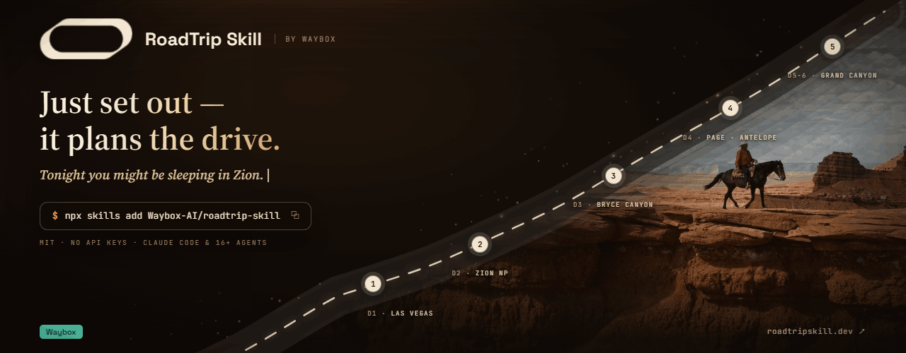
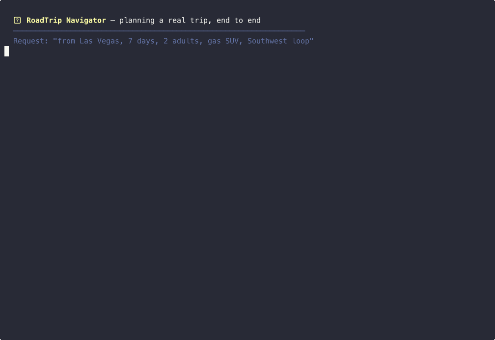

<div align="center">



# RoadTrip Navigator

**一个把「起点 + 天数」变成一份真正能照着开的自驾行程的 AI Agent 技能。**

[](LICENSE)
[](https://agentskills.io)
[](https://roadtripskill.dev)

[**网页版直接试**](https://roadtripskill.dev) · [**安装**](#安装) · [**English**](README.md)

</div>

<!-- TODO: 按发射清单录制 30–45 秒演示：安装 → 一句话生成 → 行程流出 → 改一句需求 → 网页版收尾 -->

<div align="center">
    
</div>

---

大多数 AI 行程规划给你的是一张景点愿望清单。真正握上方向盘那一刻，清单就散架了：第二天要开九个小时、营地五个月前就订完了、山口十月就封了、电车两个充电站之间只有一片荒漠。

RoadTrip Navigator 干的是那些无聊但致命的活儿。对它说：

> 从拉斯维加斯出发，7 天，2 个大人，油车 SUV，西南环线。

它会还给你**一份离线可用的单文件 HTML 行程**：

- Leaflet / OpenStreetMap 路线地图，停靠点逐一编号——每个点都带 Google / Apple Maps 一键跳转链接，逐段导航。
- 路线按合理驾驶上限切分到天，安排好过夜城镇，每天都做「天黑前到达」「园门未关」校验。
- 一份**预订倒计时清单**：精确到日期的 book-by 待办，并指向正确的预订系统（Recreation.gov / ReserveCalifornia / Parks Canada）。营地约提前 6 个月放票、园内旅馆约 13 个月、限时进入许可各有各的时间表——这笔账它替你算好。
- 长距离无补给路段预警；电车模式下逐段模拟电量（SoC）、给出建议充电目标值，可选冬季续航衰减。
- 感知季节性封路（Going-to-the-Sun、Tioga、Trail Ridge……）并自动改线；美加墨跨境证件与保险清单；到达时间做过时区校正。
- 一份预算表，每个数字都标注可信度 **verified / reference / estimate**——哪些要自己复核，一目了然。

不需要任何 API key，不需要注册账号，断网也能降级运行。MIT 开源——把代码读一遍，再决定要不要把假期交给它。

**不想装任何东西？**直接用网页版 **[roadtripskill.dev](https://roadtripskill.dev)**——输入起点、终点和日期，在浏览器里生成同样的行程。目前是 early access，前期免费、不限次数。

## 安装

Claude Code 里两条命令：

```
/plugin marketplace add Waybox-AI/roadtrip-skill
/plugin install roadtrip-navigator@roadtrip-skill
```

用 Codex、Cursor 或其他支持 SKILL.md 开放标准的工具（目前 16+ 种）：

```
npx skills add Waybox-AI/roadtrip-skill
```

然后用大白话提需求就行。改行程也像跟朋友聊天：「加一个酒庄」「我们带狗」「第 4 天开短一点」。

### MCP server — 在 Codex / Gemini CLI 里用同一套工具

skill 的实时数据工具（路线、天气、公园预约、EV 续航走廊、跨境规则…）和 HTML 渲染器也打包成了 [MCP](https://modelcontextprotocol.io) server，给跑不了 SKILL.md 工作流的 agent 用。一条命令接入，无需 clone、无需 API key：

```bash
# OpenAI Codex CLI
codex mcp add roadtrip -- uvx --from git+https://github.com/Waybox-AI/roadtrip-skill roadtrip-mcp

# Google Gemini CLI
gemini mcp add roadtrip uvx --from git+https://github.com/Waybox-AI/roadtrip-skill roadtrip-mcp
```

（需要 [uv](https://docs.astral.sh/uv/)。和上面的 `npx skills add` 是互补的：那条装的是规划知识，这条装的是工具执行层。）14 个工具清单与各宿主注意事项见 [mcp_server/README.md](mcp_server/README.md)。

## 它校验的，恰好是通用规划不管的

| 真上路时要命的事 | 通用 AI 行程 | RoadTrip Navigator |
| --- | --- | --- |
| **逐日驾驶** | 一串景点愿望单 | 按驾驶上限切分到天、安排过夜城镇、校验天黑前到达 |
| **预约** | 「记得早点订」 | 精确 book-by 日期倒计时，并指向正确的预订系统 |
| **油量 / 电量** | 完全忽略 | 无补给路段预警；逐段 SoC 模拟，含冬季衰减 |
| **季节** | 泛泛的天气建议 | 感知冬季封路的路线规划，野火 / 降雪改线 |
| **跨境与时区** | 到达时间经常算错 | 时区校正；美加墨证件、保险与通关清单 |

如果你的行程会毁在错过预约窗口、荒段没电、或山口封路上——它就是为这些失败模式造的。

## 它刻意不做的事

宁可现在说清，不要等你上了路才发现：

- **无实时数据，不做预订** 它不抓当日油价和实时空位，也不替你下单。它负责规划与校验，最终以官方渠道为准——这正是每个数字都带可信度标注的原因。
- **不支持整条路线导出（GPX / KML）**有意为之：实测中批量途经点导入可能把人导上季节性封闭道路，起点还常常漂移。所以每个停靠点给独立的一键地图链接——更稳，也不需要任何账号授权。
- **技能版需要 Agent 环境**（Claude Code 或兼容工具）。如果你不用这些，[网页版](https://roadtripskill.dev)就是零门槛的同款。

## 它是怎么实现的

如果你正在学怎么写 agent skill，这个仓库本身就是一份可运行的教材：

- [`SKILL.md`](SKILL.md) 定义了从约束解析到最终渲染的 7 步规划工作流。
- 调研任务分发给并行子代理（路线、预约、封路、充电），再汇总合并。
- 严格的数据 / 视图分离：行程是结构化数据，渲染进一个自包含的 HTML 模板。
- 三级可信度标注（`verified` / `reference` / `estimate`）写进 schema 本身，不是事后补的免责声明。
- 明确的「诚实边界」规则：模型无法核实的信息一律降级或标记，绝不编造。

## 常见问题

**为什么不直接问 ChatGPT / Claude？**
找灵感请直接问，它们真的很擅长。但裸问不会控制你的单日驾驶时长、不查封路、不算预约窗口、不模拟电量，聊天记录也没法递给副驾。差距通常从第二天开始显现。

**AI 生成的数据敢信吗？**
把它当成一份做过功课的草稿。每个数字都带可信度分级，行程里会明确告诉你哪些要去官方网站复核。「AI 会出错」是我们的设计前提，不是公关危机。

**装第三方技能安全吗？**
问得好——技能可以在你的环境里执行代码，所以只装你读得懂的。本项目完全开源（MIT）、零外部密钥、不回传任何数据。先审计再运行，开源协议就是干这个用的。

**我发现行程里有错。**
请[提一个 issue](https://github.com/Waybox-AI/roadtrip-skill/issues)。路线类 bug（封路日期不对、预约窗口有误）是我们收到的最有价值的反馈，通常一两个版本内就能以数据修复的形式上线。

## 参与贡献

欢迎提 Issue 和 PR——补一个地区主题、某个州 DOT 的封路数据、一个新的 `tools/` 客户端，或一条示例行程。这个技能零 key 即可运行，上手改造很容易。

## License

[MIT](LICENSE) © yang-hong

---

<div align="center">
<sub>由 <a href="https://waybox.ai">Waybox</a> 出品——我们也造 OMO，一台车载 AI 陪伴机器人。RoadTrip Navigator 负责出发前，OMO 负责路上。</sub>
</div>
