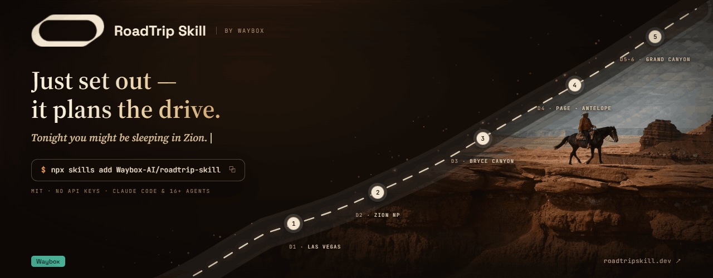
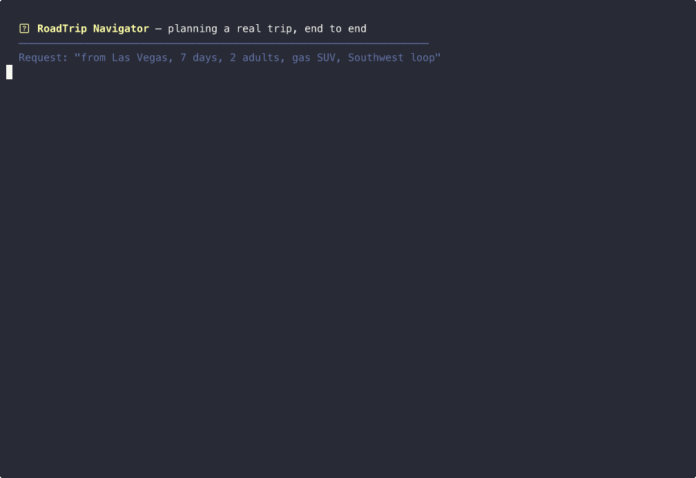

<div align="center">



# RoadTrip Navigator

**一份在出发前做过现实检修的自驾行程。**

从零规划一条路线，或者把你已经写好的行程交给它。RoadTrip Navigator 会检查那些真正决定旅程能否顺利走完的细节，再把结果整理成一份可分享、可离线查看的完整行程。

[English](README.md) · 简体中文

[](https://github.com/Waybox-AI/roadtrip-skill/actions/workflows/ci-cd.yml)
[](LICENSE)
[](INSTALL.md)
[](#安装)
[](https://roadtripskill.dev)

</div>

<div align="center">
  
</div>

## 两种开始方式

### 帮我规划一份

> 从拉斯维加斯出发，规划一条 7 天的美国西南国家公园环线。2 个大人，汽油 SUV，9 月出发。

RoadTrip Navigator 会先给出两条真正可行的候选路线，帮你比较并选择，再围绕合理的逐日驾驶、过夜地点、预订、天气、油量或电量和季节性道路状况生成完整行程。

### 帮我检查这份

> 这是我已经排好的行程。请指出其中不现实、有风险或遗漏的地方，并在不改变可用部分的前提下修好它。

你可以粘贴逐日安排、已有行程链接，或直接交给它一份现成计划。skill 会以你的路线为起点，逐日做压力测试，并明确指出类似问题：

```text
⚠ 第 3 天带孩子连续驾驶约 5.5 小时，超过建议上限。
  修改建议：在 Forks 过夜，把海岸停靠点移到第 4 天。

⚠ 预计抵达时间晚于日落，也超过了园区入口开放时间。
  修改建议：提前 90 分钟出发，或把徒步项目移到第二天。

⚠ 这段山口在你的出行日期通常处于季节性关闭状态。
  修改建议：改走冬季路线，里程将增加约 42 英里。

⚠ 电车抵达下一站时的预计剩余电量低于行程安全余量。
  修改建议：在中途加入一个直流快充站。
```

最终结果不是一串泛泛的旅行建议，而是一份修订后的完整行程：哪些检查通过、哪些地方不合理、做了什么修改、还有什么必须临行前确认，都会清楚标出。

## 它具体检查什么

大多数 AI 旅行规划很擅长提供灵感。但自驾行程往往坏在执行细节上。

| 现实检修项目 | 通用 AI 行程 | RoadTrip Navigator |
| --- | --- | --- |
| **逐日驾驶** | 把景点依次排在一起 | 按合理驾驶上限、过夜地点、日照时间和园区开放时间检查每天的路线 |
| **地名与路线** | 悄悄接受错误输入 | 先验证用户提供的地名；条件允许时，用路线工具回填每日里程和驾驶时间 |
| **天气与季节** | 泛泛给出穿衣建议 | 区分近期预报和历史气候均值，生成逐日天气提示，并检查季节性封路或改线需求 |
| **预约与预订** | “记得早点订” | 按正确平台生成带日期的待办，并分类整理酒店、餐厅和景点 |
| **油量与电量** | 通常被忽略 | 重算能源成本、提示补给稀疏路段、逐段模拟剩余电量，并在需要时加入中途快充 |
| **跨境与时区** | 抵达时间常常对不上 | 修正跨时区影响，并补充美加墨证件、保险、海关和免税额度提示 |
| **价格与可信度** | 给出看起来很精确的猜测 | 只展示有依据的价格，并把数字标成 verified、reference 或 estimate |

## 一份文件，车里所有人都能用

最终交付是一份由可编辑 `tripData.json` 生成的单文件 `trip.html`。

在手机上打开，发给副驾，打印出来，直接分享；行程修改后，也可以重新渲染。

页面中包括：

- 带编号停靠点的地图路线。
- 每一段行程的 Google Maps / Apple Maps 一键导航。
- 包含天气、用餐、活动、住宿和风险提示的逐日时间线。
- 展示每一项住宿、用餐和景点的预订页面，而不只是有截止日期的项目。
- 两条可行方案之间的路线对比。
- 会随行程修改同步更新的预算。
- 需要时显示 EV 充电计划和跨境信息。
- 响应式页面、打印配色和内置分享操作。

嵌入页面的行程数据可以离线阅读；依赖网络的地图底图和外部链接会平稳降级。

安装前可以先查看成品：

[美国西南环线，7 天](https://roadtripskill.dev/api/sample?name=sw) · [Sunnyvale → Lake Tahoe，3 天](https://roadtripskill.dev/api/sample?name=tahoe) · [Seattle → Vancouver 电车行程，4 天](https://roadtripskill.dev/api/sample?name=pnw) · [Chicago 环线，5 天](https://roadtripskill.dev/api/sample?name=chicago)

也可以直接使用免费网页版：**[roadtripskill.dev](https://roadtripskill.dev)**。

## 改变主意，不必推倒重来

自驾行程本来就会不断变化。直接用自然语言修改：

```text
把第 4 天改轻松一点。
删掉 Monterey，并把前后路线重新接起来。
在 Banff 住两晚。
换一家安静的酒店，重新安排 Lake Tahoe 的停留。
加入一个中途充电站。
刷新天气和预算。
```

规划层可以更新受影响的日期，再刷新里程、天气、能源成本、EV 电量走廊、预订倒计时、住宿链接、跨境信息和路线比较等派生内容。

## 它会告诉你依据，也会告诉你不知道什么

这里的“做过检修”不等于“绝对保证”。它意味着这份行程经过了一套明确的可行性检查，而无法消除的不确定性会被公开标出。

- **优先使用官方与免费数据源。** 路线、公园、天气、充电、跨境和住宿工具优先查询官方或开放数据，无法取得结果时再降级为结构化网络调研。
- **天气数据保留来源。** 未来十几天的天气预报，不会和几个月后的历史气候均值混为一谈。
- **数字分级。** 重要数字标记为 `verified`（已核验）、`reference`（参考值）或 `estimate`（估算值），让你知道哪些可以直接参考，哪些仍需复核。
- **工具回填硬数据。** 条件允许时，每日路线、能源成本、EV 电量走廊、预订日期、住宿链接、跨境说明和路线比较都会由确定性工具刷新。
- **边界写在成品里。** 每份行程都会提醒你在出发前通过官方渠道确认关键路况、预订和实时状态。

目前北美是道路、公园、跨境和季节规则支持最深入的区域。对于中国境内行程，支持以人民币保留预算，并在适用时提供携程住宿链接。

## 安装

### Claude Code

```text
/plugin marketplace add Waybox-AI/roadtrip-skill
/plugin install roadtrip-navigator@roadtrip-skill
```

之后直接用自然语言提出自驾需求即可。skill 会自动识别相关请求；如果希望明确调用，也可以使用 `/roadtrip`。

### Codex、Cursor 和其他兼容 SKILL.md 的 Agent

```bash
npx skills add Waybox-AI/roadtrip-skill
```

不同 Agent 的安装说明和手动安装方式见 [INSTALL.md](INSTALL.md)。

### MCP Server

路线、天气、公园、充电、跨境、住宿、地名验证和 HTML 渲染等能力，也被打包成了包含 14 个工具的 MCP Server，可用于 Codex、Gemini CLI、Claude Code 和其他 MCP Host。

```bash
# OpenAI Codex CLI
codex mcp add roadtrip -- uvx --from git+https://github.com/Waybox-AI/roadtrip-skill roadtrip-mcp

# Google Gemini CLI
gemini mcp add roadtrip uvx --from git+https://github.com/Waybox-AI/roadtrip-skill roadtrip-mcp

# Claude Code
claude mcp add roadtrip -- uvx --from git+https://github.com/Waybox-AI/roadtrip-skill roadtrip-mcp
```

skill 负责规划方法，MCP Server 提供类型化的执行工具。完整工具清单和各 Host 配置见 [mcp_server/README.md](mcp_server/README.md)。

## 工作原理

```text
自驾需求或现有行程
        │
        ▼
scripts/helper.py ── 识别模式、必填信息和地区提示
        │
        ▼
SKILL.md 工作流 ── 从零规划或检修现有行程 ── 调研与可行性检查
        │
        ▼
tripData.json ── 结构化行程与可信度元数据
        │
        ▼
assets/generate.py + assets/template.html
        │
        ▼
trip.html ── 地图、时间线、预订、预算、风险、分享与打印
```

行程数据和页面展示彼此分离：修改 JSON 后可以重新渲染，最终页面的生成过程保持确定、可复现。

## 它刻意不做什么

RoadTrip Navigator 不会承诺：

- 实时油价或电价。
- 充电站实时占用情况。
- 营地、酒店或门票的实时库存。
- 分钟级实时交通。
- 代替用户完成预订或支付。
- 替代逐向导航软件。

它也刻意不提供整条路线的 GPX/KML 批量导出。批量途经点导入可能悄悄把路线改到季节性封闭道路上，也可能从错误位置开始导航。因此，每个停靠点都会提供独立的导航链接。

请用这份行程做准备、发现问题；出发前仍需通过官方渠道确认关键封路、预约、车辆要求和当天状况。

## 项目结构

```text
.claude-plugin/    Claude Code 插件与 marketplace 配置
SKILL.md           从零规划 / 检修模式与七步工作流
reference.md       tripData schema、可信度分级、驾驶上限与工具路由
scripts/           输入解析、规划、行程编辑、路线比较和数据回填
tools/             路线、天气、公园、EV、燃油、住宿、地名、跨境和海关工具
assets/            HTML 生成器、模板和示例行程
mcp_server/        将同一组工具与渲染器暴露为 14 个 MCP 工具
tests/             离线优先的行为与渲染测试
```

如果你正在学习如何构建 Agent Skill，可以从 [SKILL.md](SKILL.md) 开始，再阅读 [AGENTS.md](AGENTS.md) 和 [reference.md](reference.md)。

## 参与贡献

欢迎提交 Issue 和 Pull Request。特别有价值的贡献包括：地区封路知识、预约规则、官方数据客户端、示例路线，以及未能通过真实出行检验的行程反馈。

发现了错误的封路日期、预订窗口、路线或充电假设？请[提交 Issue](https://github.com/Waybox-AI/roadtrip-skill/issues)。这些反馈会让之后的每一次检修更可靠。

## 贡献者

<a href="https://github.com/Waybox-AI/roadtrip-skill/graphs/contributors"></a>
<a href="https://github.com/ziminpan"></a>
<a href="https://github.com/cazermess"></a>

## License

[MIT](LICENSE) © yang-hong

---

<div align="center">
<sub>由 <a href="https://waybox.ai">Waybox</a> 出品。我们也在做车载 AI 陪伴机器人 OMO：RoadTrip Navigator 在出发前检查行程，OMO 陪你一起上路。</sub>
</div>
